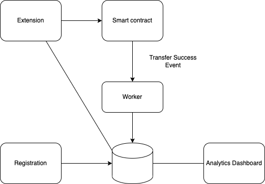

**Notice**: 
1. "advanced" marked logic will not be implemented in this MVP
2. "database" marked logic will require API design to interact with centralized database
3. "contract" marked logic will require API design to interact with smart contract

Overall architecture

### Extension
Extension for interacting mainly with end users. It will include the following feature groups:
1. onboard user: 
* create wallet
* import wallet
* sign - in with google (advanced)
2. onboard funds: 
* directly from imported wallet
* fiat on - ramp (advanced)
3. donate:
* detect address [contract](#smart-contract)
* select donation tiers (1, 5, 10, custom) (default 5)
* select accepted denomination (USDT, USDC, ...) )(default USDT)
* transfer funds [contract](#smart-contract)

**Notes**: how to shorten logic 2, 3 in donate feature group so that user can just 1 - click (fallback on default options, shift responsibility of listing donation tiers to creators, ...)
### Smart contract
1. 1 chain
	* submit link between social platform accounts and chain address
	* query by social platform link (ưu tiên)
	* query by contract address
	* accounting (số tiền, người nhận, platform nhận)
		* emit event (địa chỉ người donate, timestamp, số tiền, người nhận, platform nhận) (nếu khả thi thì thêm social platform account của người gửi)
2. Database
* map<Pair<string, string>, string> (map<Pair<social platform, profile id>, account address>)
* map<string, Pair<string, string>> (map<Pair<social platform, profile id>, account address>)

3. multi - chain design (advanced)
### Worker
query blocks from chain per every 5s [contract](#smart-contract)
### Database
* event (địa chỉ người donate, timestamp, số tiền, người nhận, platform nhận) [contract](#smart-contract)
### Registration site
* register social platforms với wallet [contract](#smart-contract)
### Analytics Dashboard (Advanced)
* Donation in 1 month, from which social platform
